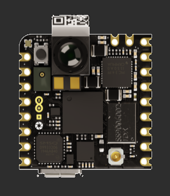
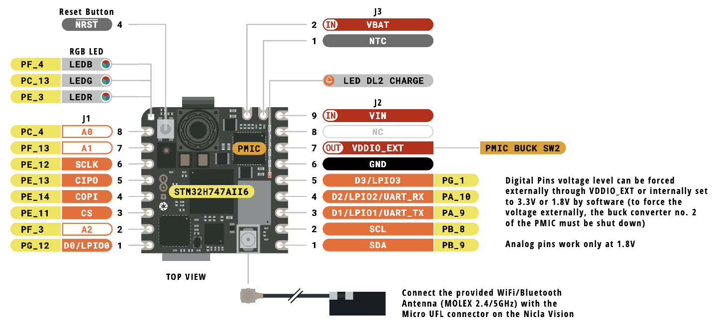

<style>
strong {color: chartreuse;}em {color: coral;}
ul {list-style: '⧐ '; margin: 0;padding: 0;}
blockquote {color: cornsilk;}
h1 {color: #ECD353; font-size:3rem;}
h2 {color: springgreen;}
h3 {color: violet;} 
code{background-color: #324858;}
pre {background-color: #324858; border-radius: 0.3rem; box-shadow: 5px 5px 10px black}
section.tit {
   background-color: #5C80BC;   
}
section.tit h1 {
   color: #E9EDDE;
   text-align: center;
   transform: scale(1.5);
}

</style>

# Nicla Vision



      eXperiência Hands-on
      Reconhecimento de Imagem
      com Edge Computing e IA.

> David Sousa-Rodrigues
> 27 de Junho 2025
>  
> 

<!-- _footer: Repositório online em https://github.com/sixhat/Nicla-Vision-Tutorial-4h -->

---


## David Sousa-Rodrigues

- Professor de Computação Física, Algoritmia, Design Computacional e
  Inteligência Artificial na Escola Superior de Artes e Design, Caldas
  da Rainha.
- Membro do centro de complexidade e design da Open University, UK.

---

# Agenda

> Apresentar as potencialidades do microcontrolador _Arduino Nicla Vison (NV)_ numa perspetiva Hands-on. 

1. Apresentação da Placa
2. 

---

## Nicla (família)


---

## Processador
Dual-core STM32H747, que inclui um Cortex M7 a 480MHz e um Cortex M4 a 240MHz. Entre eles comunicam via RPC (remote procedure calls).

---

## Inputs / Sensors

- Câmara
- Time-of-flight long distance ranging sensor (IR - luz 940nm, ±4m distância)
- Microfone omnidireccional
- IMU de 6-eixos (inertial measurment unit) (3 eixos acelerómetro + 3 eixos giroscópio), tem capacidades de ML para p.e. Fazer deteção de gestos e evitar congestionar o processador principal com essa tarefa.

---

## Comunicação

- USB
- Wifi + Bluetooth 
      - Wifi b/g/n pode funcionar como Ponto de Acesso (AP), Cliente (STA) ou ambos simultaneamente. Velocidade máxima 65Mbps
      - Bluetooth suporta BT clássico e BLE. Antena é partilhada tanto por Wifi como BT.
- UART
- I2C
- SPI

---

### Pinout (frente)


---

### Pinout (traseira)


---

### Alimentação 


---

## Câmara

- 2 Megapixel CMOS
- Ângulo do visão: 80º
- Distância focal: 2.2mm

---

## Machine Learning

Um dos atrativos principais da NV é a possibilidade de fazer Computer Vision diretamente no microcontrolador. 
Há vários modelos “leves” que permitem correr de forma “leve”
* YOLO (You Only Look Once)
* Mobilenet 

* Ambos os modelos são bastante grandes para correrem diretamente num µC.
* FOMO (Fewer Objects, More Objects)
Versão mais rápida e leve cujo objetivo é correr em µC.

---

## Comparar EdgeImpulse com Teachable Machine

- O Teachable Machine Pode permitir uma primeira abordagem ao treino de modelos personalizados antes de estarmos a trabalhar mesmo com Hardware.
- https://teachablemachine.withgoogle.com/ (O Teachable Machine também permite criar modelos personalizados de CV para arduinos — ver modelos compatíveis XXX).

---

### Exemplos de atividades:
- Blink do LED
   - 1 Led
   - LED RGB
- Explorando exemplos com os sensores:
   - IMU (accelerómetro e giroscópio)
   - Microfone
   - ToF (sensor de distância)
- Capturar Imagem e mostrar
   - Gravar imagens para a memória
   - Enviar imagem via RTSP (necessita uma WiFi configurável para podermos aceder, poderá funcionar com a Nicla como AP?!)
- AI e Edge Computing
 -  Correr um modelo pré-treinado (FOMO, deteção de faces, classificação de objetos)


---

## Sugestões de atividades
- Deteção de movimento e captura de imagem
- Tracker de objeto baseado em Cor
- LED / Câmara ativada baseada em som?
- Captura de vídeo baseado no IMU (por exemplo num acidente?)

---

<!-- _class: tit -->
# Parte prática

---

<!-- backgroundColor: #192631 -->
# Pré-requisitos

- Computador portátil com wifi, câmara e ligação à internet 
- Uma placa Arduino Nicla Vision 
- Cabo USB Micro-B - Type A (pode necessitar adaptador USB-C->Type A)

---

### Actividades

   0. setup se necessário.
    1. Início (Pisca Pisca dos LEDs).
        √ 11_blink.py 
        √ 12_blink_all.py
    2. Sensores internos.
        21_vl531x_tof_1.py (rangefinder (tof))
        inertial motion unit (imu)
        microfone?
    3. Captura de Imagem e Conectividade
        31_captura_fps.py (captura simples da câmara)
        32_ap_mode.py (streaming video P&B QVGA em modo AP)
    4. Computer Vision e Machine Learning
        teachable machine
            train image classification
            train sound 
            train pose
        √ 41_blob_detection.py
        √ 42_tf_object_detection.py

---

# Setup

A primeira vez que se conecta a NV ao computador o OpenMV IDE irá verificar se é necessário atualizar o firmware da mesma. 


---
# Início (pisca-pisca do LED)

O exercício encontra-se na pasta `./code/1-inicio`
O ficheiro `11_blink.py` contém instruções para acender o LED azul
O ficheiro `12_blink_all.py` contém instruções para acender os 3 LEDs em sequência (Red, Green, Blue).

Para experimentar cada um dos exemplos abra o ficheiro a partir do OpenMV IDE, conecte a Nicla Vision e depois corra o código.

---

### Exemplo `11_blink.py`

```python
import time
from machine import LED

TIME_TO_WAIT = 500
led = LED("LED_BLUE")  # Also available: LED_RED, LED_GREEN

while True:
    led.on()
    time.sleep_ms(TIME_TO_WAIT)
    led.off()
    time.sleep_ms(TIME_TO_WAIT)
```

---

### Exemplo `12_blink_all.py`

```python
import pyb

TIME_TO_WAIT = 500
redLED = pyb.LED(1)  # built-in red LED
greenLED = pyb.LED(2)  # built-in green LED
blueLED = pyb.LED(3)  # built-in blue LED

while True:
    redLED.on()
    pyb.delay(TIME_TO_WAIT)
    redLED.off()
    pyb.delay(TIME_TO_WAIT)

    greenLED.on()
    pyb.delay(TIME_TO_WAIT)
    greenLED.off()
    pyb.delay(TIME_TO_WAIT)

    blueLED.on()
    pyb.delay(TIME_TO_WAIT)
    blueLED.off()
    pyb.delay(TIME_TO_WAIT)

```

---

### Hello World (blink)

Nos dois exemplos apresentados observamos:

* Utilizamos python (Micropython em vez de C++, tradicionalmente utilizado com Arduinos)
* É possível utilizar C++ mas obriga a mudar o firmware da placa.
* Vemos duas formas diferentes de aceder ao hardware (LED), utilizando a biblioteca `pyb` e a biblioteca `machine`
* A `pyb` é específica para a placa **pyboard**, vendida pelo **micropython** mas compatível com a Nicla Vision.
* A `machine` é genérica para acomodar diversas boards.
—
https://docs.micropython.org/en/latest/index.html

---

## Deteção de Blobs de cor.


Abra o exemplo `31_blob_detection.py` no editor OpenMV IDE.

* O Detetor de blobs funciona em espaço de cor La\*b\* (Lightness, a*, e b*, sendo que o a* é b* representa a perceção de cor vermelho–verde e azul–amarelo 

---

### Deteção de Blobs

Estrutura do código

```txt
   importa módulos necessários
   definir variáveis de captura da Nicla Vision
   definir mínimos e máximos para os diversos blobs  
   e um conjunto de cores para os representar
   inicializa o relógio
   loop continuo:
      captura imagem
      encontra blobs
      para cada blob
         desenha um rectângulo e uma cruz no centro
      um pequeno delay 
      imprime o n.º de frames por segundo
```

---

### Deteção de Blobs - atividade


* Escolha dois objetos de cores diferentes.
* Corra o modelo `41_blob_detection.py` 
* Defina o espaço de cores como LAB a partir do drop-down da interface.
* Mostre à câmara um objeto colorido (por exemplo uma t-shirt) e na imagem capturada pela câmara desenhe um retângulo de forma a capturar a maioria desse objeto.
* No histograma LAB tome nota dos valores min e max para cada componente e substitua-os na variável `blob1`. 
* Faça o mesmo com outro objeto, agora substituindo os valores da variável `blob2`.

---


* Em alternativa aos dois últimos pontos, utilize a ferramenta `Tools > Machine Vision > Threshold Editor` para definir os mínimos e máximos de uma forma visual.
* Corra o modelo novamente e agora mostre os objetos à câmara. Verifique que os blobs são detetados.

---

### Explore o código e responda (5 min):

* Qual o efeito de alterar o tamanho mínimo de deteção para áreas maiores e menores?
* Qual o efeito de não fazer merge dos blobs que se sobreponham?
* Qual o n. de frames por segundo máximo que obtém? (comentem a linha com o delay)

