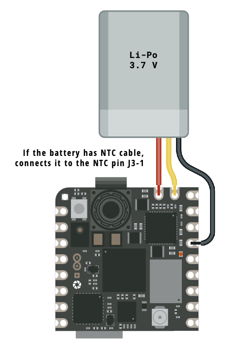

<style>
* {margin:0; padding:0}
strong {color: chartreuse;}em {color: coral;}
ul {list-style: '∞   '; margin: 0;padding: 0;}
blockquote {color: cornsilk;}
h1 {color: #E6F17B; font-size:3rem;}
h2 {color: springgreen;}
h3 {color: violet;} 
h1,h2,h3 {column-span: all; border-bottom: 1px solid}
code{background-color: #324858;}
pre {background-color: #324858; border-radius: 0.3rem;}
section {
   align-content: baseline;
}
footer {
   border-top: 1px solid;
   text-align: center;
   width: 100%;
   font-size: 14px;
}
footer a {
   color: #aaa;
}
section.tit {
   background-color: #5C80BC;   
   align-content: center;
}
section.tit h1 {
   color: #E9EDDE;
   text-align: center;
   transform: scale(1.5);
}
section::after {
   font-size: 80%;
   background: darkred;
   border-radius: 1em;
   color: #E6F17B;
   padding: 0 0.5em 0 0.5em;
}
section.sm  {
   font-size: 24px;
   color: white;
}
section.two {
   column-count: 2;
}
section.two * {
   font-size: 1em;
}
section.two footer {
   font-size: 14px;
}
p > img {
   display: flex;
}
img {
   border-radius: 0.67em;
   margin: 0 auto;
   display: flex;
}
img.square {
   border-radius: 0;
}
img.center {
   margin: 0 auto;
}
img.left {
   float: left;
   margin-right: 1em;
}
img.right {
   float:right;
   margin-left: 1em;
}
</style>


<!-- _paginate: false -->
# eXperiência Hands-on Reconhecimento de Imagem com Edge Computing e IA.


> David Sousa-Rodrigues
> António Gonçalves
> 27 de Junho 2025


<!-- _footer: Repositório online em https://github.com/sixhat/Nicla-Vision-Tutorial-4h -->


## David Sousa-Rodrigues
<!-- _class: two invert -->


- Professor de Computação Física, Algoritmia, Design Computacional e
  Inteligência Artificial na Escola Superior de Artes e Design, Caldas
  da Rainha.
- Membro do centro de complexidade e design da Open University, UK.


# Agenda

<!-- footer: <a href="#agenda">Agenda</a>—<a href="#1-led-interno">1. LED interno</a>—<a href="#2-sensores-internos">2. Sensores Internos</a>—<a href="#3-c%C3%A2mara-e-wifi">3. Câmara e Wifi</a>—<a href="#4-machine-learning">4. Machine Learning</a> -->

> Apresentar as potencialidades do microcontrolador [Arduino Nicla Vision (NV)](https://www.arduino.cc/pro/hardware-nicla-family/) numa perspetiva Hands-on. 

1. Apresentação da Placa e sua família
2. Parte Prática
   1. Introdução e testes de setup com LED RGB interno
   2. Os diversos sensores da placa
   3. A câmara e a conetividade Wifi / Bluetooth
   4. Computer Vision e Machine Learning


## Nicla (família)


## Nicla Vision (frente)


## Nicla Vision (costas)


## Processador


Dual-core STM32H747, que inclui um **ARM Cortex M7 a 480MHz** e um **ARM Cortex M4 a 240MHz**. 
Entre eles comunicam via RPC (remote procedure calls).


<!-- ## Inputs / Sensors

- Câmara
- Time-of-flight long distance ranging sensor (IR - luz 940nm, ±4m
  distância)
- Microfone omnidireccional
- IMU de 6-eixos (inertial measurment unit) (3 eixos acelerómetro + 3
  eixos giroscópio), tem capacidades de ML para p.e. Fazer deteção de
  gestos e evitar congestionar o processador principal com essa tarefa.
 -->


## Comunicação

- USB
- Wifi + Bluetooth 
      - Wifi b/g/n pode funcionar como Ponto de Acesso (AP), Cliente (STA) ou ambos simultaneamente. Velocidade máxima 65Mbps
      - Bluetooth suporta BT clássico e BLE. Antena é partilhada tanto por Wifi como BT.
- UART
- I2C
- SPI


### Pinout (frente)


### Pinout (traseira)


### Alimentação 
<!-- _class: invert two -->

 




## Câmara

- 2 Megapixel CMOS
- Ângulo do visão: 80º
- Distância focal: 2.2mm


## Machine Learning

- A **NV** permite Computer Vision.
- Há diversos modelos “leves” disponíveis:

* YOLO (You Only Look Once)
* Mobilenet 
> Ambos os modelos são bastante grandes para correrem diretamente num µC (embora haja versões _lite_).
* FOMO (Fewer Objects, More Objects)
Versão mais rápida e leve cujo objetivo é correr em µC edge.
> Tipicamente os dispositivos edge requerem modelos pequenos quantizados para inteiros após o treino.


## Exemplos de aplicações para Nicla Vision
- Deteção de movimento e captura de imagem
- Tracker de objeto baseado em Cor
- LED / Câmara ativada baseada em som?
- Captura de vídeo baseado no IMU (por exemplo num acidente?)
- Sistemas de segurança


# Parte prática
<!-- _class: tit -->
<!-- backgroundColor: #224 -->


# Pré-requisitos


- Computador portátil com wifi, câmara e ligação à internet 
- Uma placa Arduino Nicla Vision 
- Cabo USB Micro-B - Type A (pode necessitar adaptador USB-C->Type A)


### Atividades

    0. setup, se necessário.
    1. Início (Pisca Pisca dos LEDs).
        √ 11_blink.py 
        √ 12_blink_all.py
    2. Sensores internos.
        √ 21_vl531x_tof_1.py (rangefinder (tof))
        √ inertial motion unit (imu)
        √ microfone?
    3. Captura de Imagem e Conectividade
        √ 31_captura_fps.py (captura simples da câmara)
        √ 32_ap_mode.py (streaming video P&B QVGA em modo AP)
    4. Computer Vision e Machine Learning
        √ teachable machine
            train image classification
            train sound 
            train pose
        √ 41_blob_detection.py
        √ 42_tf_object_detection.py (utiliza um modelo pré treinado para detetar caras)


# Setup

- Antes de conectar pela primeira vez a **NV** deve colocar a antena.

- Verifique se tem o software [OpenMV IDE](https://openmv.io/pages/download) instalado.

- Ao conectar a NV ao computador o OpenMV IDE irá verificar se é necessário atualizar o firmware da mesma.

---


## Atualizar firmware


> Pode-se forçar a tentativa de atualização (mesmo que já tenha o último firmware) colocando a placa em modo bootloader fazendo um duplo clique no botão reset.
> A placa fará fade-in-out do LED verde indicando estar em modo bootloader.


# 1. LED interno
<!-- _class: tit -->
<!-- backgroundColor: #300; -->
<!-- footer: <a href="#agenda">Agenda</a>—<a href="#1-led-interno">1. LED interno</a>—<a href="#2-sensores-internos">2. Sensores Internos</a>—<a href="#3-c%C3%A2mara-e-wifi">3. Câmara e Wifi</a>—<a href="#4-machine-learning">4. Machine Learning</a> -->

---

- Ao comprar uma placa o primeiro objetivo é ver se está a funcionar. 

- Vamos colocar o LED RGB interno a funcionar de duas formas diferentes. 
 
> O código dos exercícios encontra-se na pasta `./code/1-inicio`

- O ficheiro `11_blink.py` contém instruções para acender o LED azul
- O ficheiro `12_blink_all.py` contém instruções para acender os 3 LEDs em sequência (Red, Green, Blue).

> Para experimentar cada um dos exemplos abra o ficheiro a partir do OpenMV IDE, conecte a Nicla Vision e depois corra o código.


### Exemplo `11_blink.py`

```python
import time
from machine import LED

TIME_TO_WAIT = 500
led = LED("LED_BLUE")  # Also available: LED_RED, LED_GREEN

while True:
    led.on()
    time.sleep_ms(TIME_TO_WAIT)
    led.off()
    time.sleep_ms(TIME_TO_WAIT)
```


### Exemplo `12_blink_all.py`

<!-- _class: invert sm -->

```python
import pyb

TIME_TO_WAIT = 500
redLED   = pyb.LED(1)  # built-in red LED
greenLED = pyb.LED(2)  # built-in green LED
blueLED  = pyb.LED(3)  # built-in blue LED

while True:
    redLED.on()
    pyb.delay(TIME_TO_WAIT)
    redLED.off()
    pyb.delay(TIME_TO_WAIT)

    greenLED.on()
    pyb.delay(TIME_TO_WAIT)
    greenLED.off()
    pyb.delay(TIME_TO_WAIT)

    blueLED.on()
    pyb.delay(TIME_TO_WAIT)
    blueLED.off()
    pyb.delay(TIME_TO_WAIT)
```


### Início (blink)

Nos dois exemplos apresentados observamos:

* Utilizamos **python** (Micropython em vez de C++, tradicionalmente utilizado com Arduinos)
* É possível utilizar C++ mas obriga a mudar o firmware da placa.
* Vemos duas formas diferentes de aceder ao hardware (LED), utilizando a biblioteca `pyb` e a biblioteca `machine`
* A `pyb` é específica para a placa **pyboard**, vendida pelo **micropython** mas compatível com a Nicla Vision.
* A `machine` é genérica para acomodar diversas boards.
—
https://docs.micropython.org/en/latest/index.html

# 2. Sensores Internos
<!-- backgroundColor: #030; -->
<!-- _class: tit  -->

## Vamos explorar:

- sensor de distância 
- sensor de inércia
- microfone

> Os exemplos encontram-se na pasta `./code/2-sensores_internos`

## Sensor de distância

Código em `21_vl53l1x_tof_1.py`


* Utiliza o sensor VL53L1X (time of flight)
* Emissor laser, 980nm
* Array de recetores
* Até 4m de distância

## Sensor de distância

```python
from machine import I2C
from vl53l1x import VL53L1X
import time

tof = VL53L1X(I2C(2))

while True:
    print(f"Distance: {tof.read()}mm")
    time.sleep_ms(50)
```

* **Consegue estimar o ângulo de cobertura (FoV) do sensor?**
* Segundo o datasheet é ~27º


## Sensor de Inércia

- [LSM6DSOX](https://www.st.com/en/mems-and-sensors/lsm6dsox.html#documentation) tem um acelerómetro e um giroscópio de 3 eixos. 
- Interface SPI (Serial Parallel Interface)
- Carregue e corra o exemplo `22_lsm6dsox_basic.py`
- Experimente mover a **NV** e observe os valor apresentados no terminal do OpenMV.

## Sensor de Inércia (código)

```python
import time
from lsm6dsox import LSM6DSOX
from machine import Pin
from machine import SPI

lsm = LSM6DSOX(SPI(5), cs=Pin("PF6", Pin.OUT_PP, Pin.PULL_UP))

while True:
    print("Accelerometer: x:{:>8.3f} y:{:>8.3f} z:{:>8.3f}".format(*lsm.accel()))
    print("Gyroscope:     x:{:>8.3f} y:{:>8.3f} z:{:>8.3f}".format(*lsm.gyro()))
    print("")
    time.sleep_ms(100)
```

## Sensor Microfone


A **NV** está equipada com um microfone omni-direcional 

o código encontra-se no ficheiro `23_audio_fft.py`. Importante notar os seguintes aspetos:

* `audio.start_streaming` e `audio.stop_streaming` para começar e parar a captura
* utiliza a biblioteca de cálculo numérico `numpy` em vez de vetores nativos python

# Intervalo
<!-- _class: tit -->
<!-- _footer: "" -->
<!-- backgroundColor: #363 -->

# 3. Câmara e Wifi
<!-- _class: tit -->
<!-- backgroundColor: #303; -->


## Exemplos de utilização da câmara e wifi

> Os exemplos encontram-se na pasta `./code/3-captura-imagem`

- `31_captura_fps.py` - Ilustra a captura de imagens a partir da câmara da **NV**.
- `32_ap_mode.py` - Ilustra a utilização da **NV** como um ponto de acesso (AP) wifi. 

## Captura de imagem

```python
import sensor
import time

sensor.reset()  
sensor.set_pixformat(sensor.RGB565) 
sensor.set_framesize(sensor.QVGA)  #Outros formatos são suportados
sensor.skip_frames(time=2000)  
clock = time.clock() 

while True:
    clock.tick()  
    img = sensor.snapshot()  
    print(clock.fps()) 
```

> Experimentar outros `framesize` para perceber as diferenças de performance
> eg: QQVGA, VGA, SVGA e XVGA, experimentar desligar a visualização.

## Acesso remoto à câmara (Wifi)


> Vamos tornar a **NV** num AP ao qual podemos aceder com o telemóvel.

1. abram o ficheiro `32_ap_mode.py`
2. editem a _linha 16_ para definir um SSID (temos 5 **NV** pelo que os SSIDs devem ser diferentes)
3. Corram o código na Nicla Vision
4. Acedam a este ponto de acesso com o telemóvel juntando-se à rede recentemente criada e abram o browser no endereço **http://IP_DA_NV:8080**

> Nota, o código permite o estabelecimento da ligação de um cliente de cada vez apenas.

# 4. Machine Learning
<!-- _class: tit -->
<!-- backgroundColor: #004; -->

## Caveat, disclaimer e explicações (ou desculpas)
<!-- _backgroundColor: #444; -->

A parceria entre a [Arduino](https://www.arduino.cc/) e a [Edge Impulse](https://studio.edgeimpulse.com) faz com que o treino de datasets para a Nicla Vision seja executado normalmente no website do Edge Impulse. No entanto, o treino de modelos no Edge Impulse é relativamente complicado para uma sessão tão curta. Para ilustrar os conceitos vamos utilizar o Teachable Machine da Google.


## Modelos Computer Vision
<!-- _backgroundColor: #111111 -->


## Plano 

      Teachable Machine ——— teachablemachine.withgoogle.com
         - 1 Exemplo de deteção de imagens (objetos)
         - 1 Exemplo de reconhecimento de som
         - 1 exemplo de reconhecimento de poses
      Deteção de Blobs
      Aplicação de um modelo pré-treinado para deteção de caras

## Teachable Machine (TM)


Teachable Machine é uma ferramenta online gratuita do Google que permite criar modelos de Machine Learning de forma simples e sem precisar programar.

Com ele, podemos treinar modelos para:

      - Reconhecer imagens (ex: objetos, pessoas)
      - Reconhecer sons (ex: palmas, fala)
      - Reconhecer poses corporais (ex: gestos, movimentos)

Aceder em: https://teachablemachine.withgoogle.com/

## TM - Reconhecimento de imagens

1. Escolher Get Started
2. Criar um Projeto Novo do tipo "Image Project" e "Standard image model"
3. Definir o n. de classes para o n. de categorias pretendidas (não esquecer de incluir uma categoria vazia)
4. Utilizar a câmara do portátil para capturar exemplos dos objetos 
5. Treinar o modelo clicando em "Train Model".
6. Testar o modelo

> As imagens capturadas não são enviadas para o Google. Ficam apenas no browser durante a execução do treino. 

## TM - Reconhecimento de voz

1. Criar um projeto novo do tipo Audio Project.
2. Neste caso é necessário extrair amostras do ruído de fundo. Depois de gravar cada uma das amostras é necessário clicar em "Extract Sample"
3. Também para os comandos pretendidos é necessário gravar pelo menos 8 amostras e fazer "Extract Sample"
4. Treinar o modelo 
5. Testar o modelo

## TM - Deteção de Pose


1. Crie um projeto de deteção de Poses para classificar diferentes poses. 
2. Por exemplo uma pose pode indicar com um braço no ar pode indicar "Pedir ajuda" e outra com os dois braços pode indicar "Parar tudo"


## TM - Modelos para microcontroladores

- O Teachable Machine permite exportar estes modelos. No entanto, os modelos exportados não são compatíveis com a **Nicla Vision**, sendo apenas suportados pelo Arduino Nano 33 BLE Sense (EOL) 

- Os modelos **tensorflow lite** tem que ser **quantizados** (pesos da rede neuronal tem que ser int8 em vez de float32), mas tal exige ter um conjunto de amostras representativas do modelo para obter os intervalos de dados.

- Em alternativa pode-se treinar modelos no Edge Impulse (https://edgeimpulse.com/) que são compatíveis com a Nicla Vision (embora os projetos não sejam tão intuitivos de executar como no Teachable Machine)       

## Deteção de Blobs.

> A deteção de blobs procura definir regiões de uma imagem que possam ser consideradas uniformes (até uma determinada tolerância)

* Há diversos critérios de uniformidade:
  * Cor
  * Circularidade
  * Excentricidade
  * ...

## Instruções 

<!-- _class: invert two -->

> Blobs baseados na similaridade de cor

* Abra o exemplo `41_blob_detection.py` no editor OpenMV IDE.

* O Detetor de blobs funciona em espaço de cor La\*b\*—_Luminosidade, a*, e b*, sendo que o a* é b* representam a perceção de cor vermelho–verde e azul–amarelo_


### Deteção de Blobs

Pseudo-código `31_blob_detection.py`

```txt
   importa bibliotecas
   define variáveis de captura da Nicla Vision
   define mínimos e máximos para os diversos blobs  
   define um conjunto de cores para os representar
   inicializa o relógio
   loop continuo:
      captura imagem
      encontra blobs
      para cada blob
         desenha um retângulo e uma cruz no centro de cada blob
      um pequeno delay 
      imprime o n.º de frames por segundo
```

### Deteção de Blobs - atividade
<!-- _class: sm invert two -->

* Corra o modelo `41_blob_detection.py` 
* Defina o espaço de cores como **LAB Color Space** a partir do drop-down.
* Mostre à câmara diversos objetos e na imagem capturada desenhe um retângulo de forma a circunscrever o objeto.
* No histograma **LAB** tome nota dos valores _min_ e _max_ para cada componente e substitua-os na variável `blob1`. 
* Faça o mesmo com outro objeto, agora substituindo os valores da variável `blob2`.


### Deteção de Blobs - Threshold Editor

<!-- _class: two invert sm -->

* Em alternativa aos dois últimos pontos, utilize a ferramenta `Tools > Machine Vision > Threshold Editor` para definir os mínimos e máximos de uma forma visual.
* Corra o modelo novamente e agora mostre os objetos à câmara. Verifique que os blobs são detetados.


### Explore o código e responda (5 min):

* Qual o efeito de alterar o tamanho mínimo de deteção para áreas maiores e menores?
* Qual o efeito de não fazer merge dos blobs que se sobreponham?
* Qual o n. de frames por segundo máximo que obtém? (comentem a linha com o delay)

## Deteção de Caras, modelo pré treinado.


> Neste exemplo vamos utilizar um modelo pré treinado para a deteção de caras.
> O modelo pode ser encontrado na pasta `./code/4-machine-learning` no exemplo `42_tf_object_detection.py`

1. Copie os ficheiros `fomo_face_detection.tflite` e `fomo_face_detection.txt` para a raiz do volume da **NV**
2. Abra o ficheiro `42_tf_object_detection.py` no OpenMV e corra o modelo.


# Conclusões
<!-- backgroundColor: #333300 -->

A computação Edge está cada vez mais acessível. 

A **NV** é relativamente acessível e relativamente fácil de utilizar.

Software + Hardware nem sempre ligam bem uma vez que o Software da Edge Impulse é também utilizado para outras placas com mais capacidades levando a erros e alguns crashes.

# Obrigado
<!-- _backgroundColor: #132 -->

A apresentação e exemplos estão online em:

https://sixhat.github.io/Nicla-Vision-Tutorial-4h/

https://github.com/sixhat/Nicla-Vision-Tutorial-4h